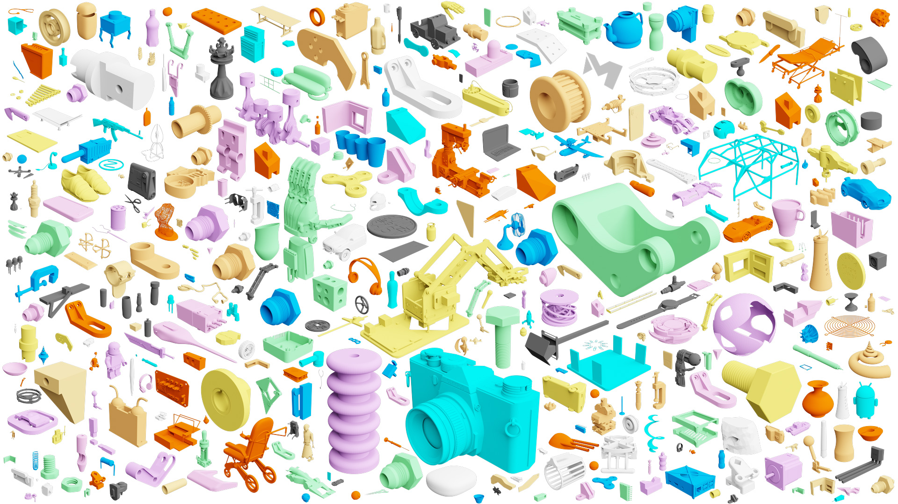
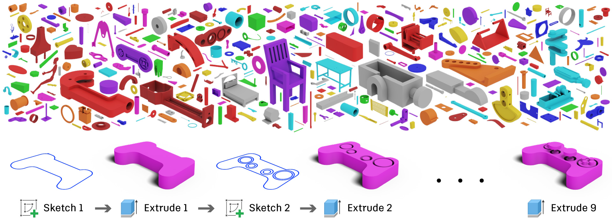
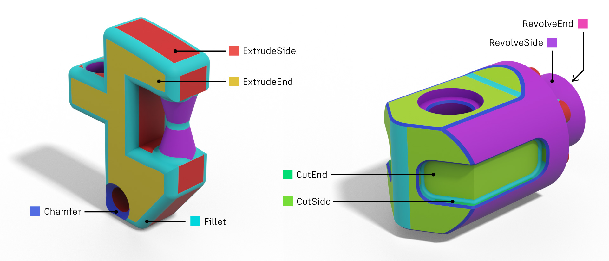

# Fusion 360 Gallery Dataset


The *Fusion 360 Gallery Dataset* contains rich 2D and 3D geometry data derived from parametric CAD models. The dataset is produced from designs submitted by users of the CAD package [Autodesk Fusion 360](https://www.autodesk.com/products/fusion-360/overview) to the [Autodesk Online Gallery](https://gallery.autodesk.com/fusion360). The dataset provides valuable data for learning how people design, including sequential CAD design data, designs segmented by modeling operation, and design hierarchy and connectivity data.

## Datasets
From the approximately 20,000 designs available we derive several datasets focused on specific areas of research. Currently the following data subsets are available, with more to be released on an ongoing basis.

### [Reconstruction Dataset](docs/reconstruction.md)
Sequential construction sequence information from a subset of simple 'sketch and extrude' designs.



### [Segmentation Dataset](docs/segmentation.md)

A segmentation of 3D models based on the modeling operation used to create each face, e.g. Extrude, Fillet, Chamfer etc...




## Publications
Please cite the relevant paper below if you use the Fusion 360 Gallery dataset in your research.

#### Reconstruction Dataset
[Fusion 360 Gallery: A Dataset and Environment for Programmatic CAD Reconstruction](https://arxiv.org/abs/2010.02392)
```
@article{willis2020fusion,
    title={Fusion 360 Gallery: A Dataset and Environment for Programmatic CAD Reconstruction},
    author={Karl D. D. Willis and Yewen Pu and Jieliang Luo and Hang Chu and Tao Du and Joseph G. Lambourne and Armando Solar-Lezama and Wojciech Matusik},
    journal={arXiv preprint arXiv:2010.02392},
    year={2020}
}
```

#### Segmentation Dataset
[BRepNet: A topological message passing system for solid models](https://arxiv.org/abs/2104.00706)
```
@inproceedings{lambourne2021brepnet,
 title = {BRepNet: A topological message passing system for solid models},
 author = {Joseph G. Lambourne and Karl D.D. Willis and Pradeep Kumar Jayaraman and Aditya Sanghi and Peter Meltzer and Hooman Shayani},
 eprint = {2104.00706},
 eprinttype = {arXiv},
 eprintclass = {cs.LG},
 booktitle = {IEEE Conference on Computer Vision and Pattern Recognition (CVPR)},
 year = {2021}
}
```

## Download

| Dataset | Designs | Documentation | Download | Paper |
| - | - | - | - | - |
| Reconstruction | 8,625 | [Documentation](docs/reconstruction.md) | [r1.0.0 - 2.0 GB](https://fusion-360-gallery-dataset.s3-us-west-2.amazonaws.com/reconstruction/r1.0.0/r1.0.0.zip) | [Paper](https://arxiv.org/abs/2010.02392) |
| Segmentation |  35,858 | [Documentation](docs/segmentation.md) | [s1.0.0 - 2.9 GB](https://fusion-360-gallery-dataset.s3-us-west-2.amazonaws.com/segmentation/s1.0.0/s1.0.0.zip) | [Paper](https://arxiv.org/abs/2104.00706) |


## Tools
As part of the dataset we provide various tools for working with the data. These tools leverage the [Fusion 360 API](http://help.autodesk.com/view/fusion360/ENU/?guid=GUID-7B5A90C8-E94C-48DA-B16B-430729B734DC) to perform operations such as geometry reconstruction, traversing B-Rep data structures, and conversion to other formats. More information can be found in the [tools directory](tools).


## License
Please refer to the [dataset license](LICENSE.md).
