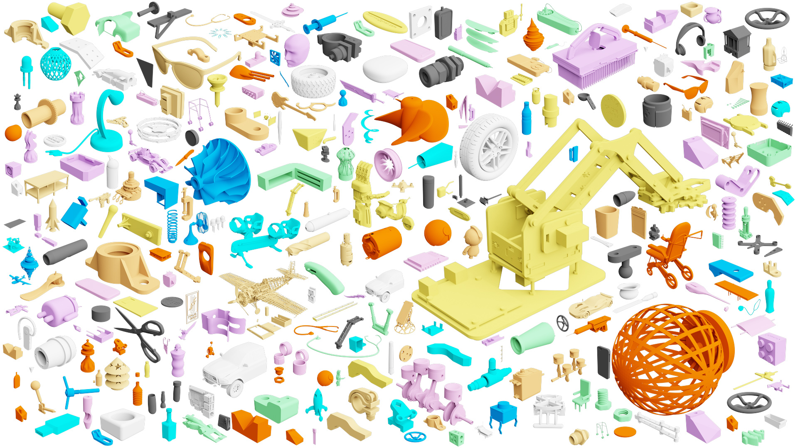

# Fusion 360 Gallery Dataset

The *Fusion 360 Gallery Dataset* contains rich 2D and 3D geometry data derived from parametric CAD models. The dataset is produced from designs submitted by users of the CAD package [Autodesk Fusion 360](https://www.autodesk.com/products/fusion-360/overview) to the [Autodesk Online Gallery](https://gallery.autodesk.com/fusion360). The dataset provides valuable data for learning how people design, including sequential CAD design data, designs segmented by modeling operation, engineering sketches with dimensions and constraints, and design hierarchy and connectivity data.

## Data Subsets
From the approximately 20,000 designs available we derive several data 'subsets' focused on specific areas of research. Currently the following data subsets are available to download, with more to be released on an ongoing basis.

- [Segmentation Subset](docs/segmentation.md): A segmentation of design bodies based on the modeling operation used to create each face, e.g. Extrude, Fillet, Chamfer etc...
-  [Reconstruction Subset](docs/reconstruction.md): Sequential design data from a subset of simple 'sketch and extrude' components that enables final geometry to be reconstructed.

## Download
The following data subsets are available to download:

| Data Subset | Download |
| - | - | - |
| [Segmentation](docs/segmentation.md) | - |
| [Reconstruction](docs/reconstruction.md) | [Version d4](https://github.com/karldd/Fusion360GalleryDataset/releases/tag/d4) |

## Documentation
Documentation of the dataset is ongoing and will include details of the formats used in the dataset and statistics about the dataset as a whole. Documentation can be found in the [docs directory](docs).

## Tools
As part of the dataset we provide various tools for working with the data. These tools leverage the [Fusion 360 API](http://help.autodesk.com/view/fusion360/ENU/?guid=GUID-7B5A90C8-E94C-48DA-B16B-430729B734DC) to perform operations such as geometry reconstruction, traversing B-Rep data structures, and conversion to other formats. More information can be found in the [tools directory](tools).

## License
The dataset is provided for non-commercial research. Full details of the license will be added shortly.

## Publications
As we publish the data we benchmark tasks we will provide a list of research papers and citations here.
