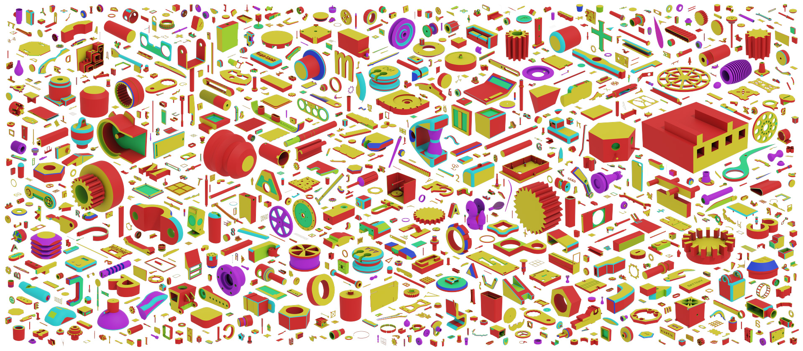

# Fusion 360 Gallery Dataset Documentation
Here you will find documentation of the data released as part of the Fusion 360 Gallery Dataset. Each dataset is extracted from designs created in [Fusion 360](https://www.autodesk.com/products/fusion-360/overview) and then posted to the [Autodesk Online Gallery](https://gallery.autodesk.com/) by users. 

## Datasets
We derive several datasets focused on specific areas of research. The 3D model content between data subsets will overlap as they are drawn from the same source, but will likely be formatted differently. We currently provide the following datasets.

### [Segmentation Dataset](segmentation.md)
The Segmentation Dataset contains segmented 3D models based on the modeling operation used to create each face, e.g. Extrude, Fillet, Chamfer etc... 

### [Reconstruction Dataset](reconstruction.md)
The Reconstruction Dataset contains construction sequence information from a subset of simple 'sketch and extrude' designs.

## Tools
We provide [tools](../tools) to work with the data using Fusion 360. Full documentation of how to use these tools and write your own is provided in the [tools](../tools) directory.
