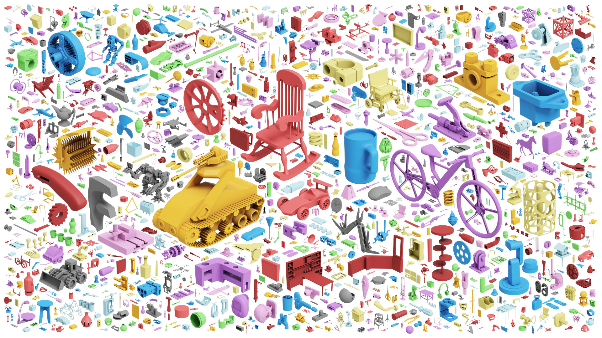
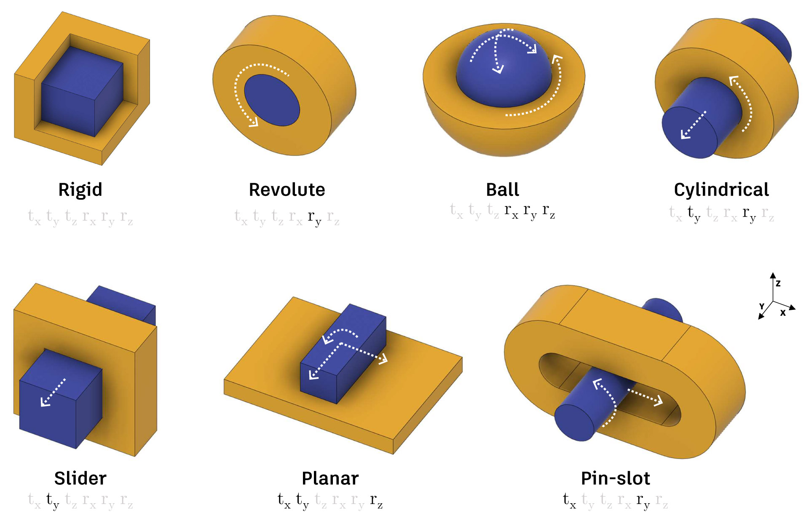
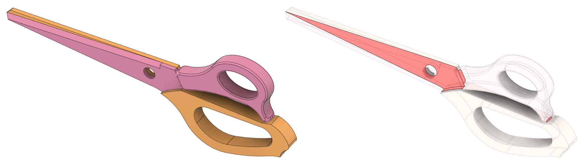
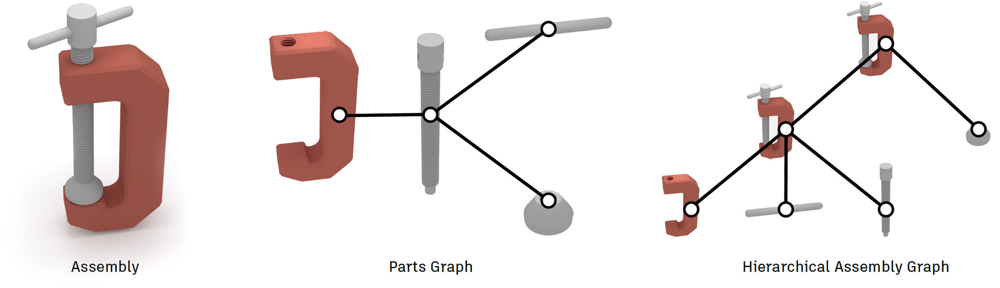

# Assembly Dataset
The Assembly Dataset contains design data from CAD assemblies containing multiple parts. In mechanical CAD software, assemblies are collections of parts represented as 3D shapes, that together represent an overall design, or object. 




## Overview
The Assembly Dataset contains 8,251 assemblies, and a total of 154,468 separate parts. 
Individual parts can be grouped together into components that represent reusable parts of a design, for example
a single screw or a sub-assembly containing multiple components. Components can be positioned in global coordinates or 
constrained to one another using joints.

## Data Formats
We provide the geometry in B-Rep and mesh data formats, described below. Parameter information about the asembly is provided in JSON text format. Other representations, such as point clouds or voxels, can be generated from the mesh or B-Rep data using existing data conversion routines and are not included in the dataset. For convenience, we include a thumbnail .png image file together with each body and one for the overall assembly. We use universally unique identifiers (UUID) to cross-reference elements with the JSON data. Geometry files are named according to the UUID of the body in the assembly, with the overall assembly files given the name 'assembly' with the appropriate file extension.

### B-Rep
B-Rep data is provided as .smt files representing the ground truth geometry and .step as an alternate neutral B-Rep file format. The .smt file format is the native format used by Autodesk Shape Manager, the CAD kernel within Fusion 360, and has the advantage of minimizing conversion errors. The B-Rep entities, such as faces and edges, can be referenced by index from the JSON back to entities in the .smt file.

### Mesh
Mesh data is provided in .obj format representing a triangulated version of the B-Rep. Triangles belonging to each B-Rep faces are denoted in the .obj file as groups, for example, `g face 1`, indicates the next series of triangles in the file belong to the B-Rep face with index 1. B-Rep edges are converted to poly lines and added to the .obj file. The B-Rep edge and half-edge index is also denoted, for example, `g halfedge 7 edge 3`.  Using these group indices it is possible to map directly from B-Rep faces and edges to mesh triangles and poly lines. Note that meshes provided in the dataset are not guaranteed to be manifold. 


### Assembly JSON
Our assembly data is provided in a JSON file with the following top-level structure:

```js
{
    "tree": {...},
    "root": {...},
    "occurrences": {...},
    "components": {...},
    "bodies": {...},
    "joints": {...},
    "as_built_joints": {...},
    "contacts": [...],
    "holes": [...],
    "properties": {...}
}
```

The table below briefly describes the top-level data elements in the JSON:

| Element      | Description |
| :--- | :--- |
| `tree`   | The designer-defined hierarchy of occurrences in the design. Often used to organize sub-assembles into a meaningfully hierarchy        |
| `root`      | The root component of the design as defined by the designer       |
| `occurrences`   | Instances of components, referencing the parent component with instance properties such as location, orientation, and visibility        |
| `components`   | Components containing bodies or other components to form sub-assemblies        |
| `bodies`   | The underlying 3D shape geometry in the B-Rep format        |
| `joints`   | Constraints defining the relative pose and degrees of freedom (DOF) between a pair of occurrences        |
| `as_built_joints`   | Joints that maintain their position in space and are not transformed        |
| `contacts`   | Faces that are in contact between different bodies        |
| `holes`   | A list of hole features with information about the type of hole, size, direction, and location        |
| `properties`   | Statistical information and metadata about the overall assembly        |

The structure and representation of the data follows the [Fusion 360 API](https://help.autodesk.com/view/fusion360/ENU/?guid=GUID-A92A4B10-3781-4925-94C6-47DA85A4F65A).


### Units
All units are provided in cm, including 3D model geometry and distance parameters stored in the JSON files. Angular units are provided in radians.


## Assembly

### Tree
The dataset contains information about the hierarchy of parts defined by the designer. The tree contains this hierarchy information by linking to occurrence UUIDs. The tree can be represented as a hierarchical assembly graph, as described in [Assembly Graph Representations](#assembly-graph-representations).

An example JSON entry for the element:

```js
{
    "tree": {
        "root": {
            "5090a890-05a1-11ec-9330-0621f375c677": {
                "5092a452-05a1-11ec-b4e8-0621f375c677": {}
                },
                ...
        }
    }
}
```

### Root
The root of the assembly refers to the root node from which the hierarchical assembly graph can be constructed. The root links to the component UUID that the designer specified to be at the top of the tree, and it also links to any bodies that might be contained by the root.

An example JSON entry for the root element:

```js
{
    "root": {
        "component": "51a05228-0573-11ec-ba85-06368d9f66a5",
        "bodies": {...}
        }
}
```

### Occurrences
Occurrences are instances of components that can have independent parameters applied, such as visibility, location, and orientation, while maintaining the same geometry as their parent component. An occurrence is to component, as Object is to Class in object-oriented programming. Occurrences are given a UUID and link to the component, and any bodies it includes. 

The flag `is_grounded` indicates whether the user locked the position of the occurrence, preventing further movements from happening via mouse-dragging in the Fusion 360 UI. The flag `is_visible` indicates whether the occurrence was displayed or not in the UI.

Each occurrence also has information about the physical properties (aggregating the center of mass, area, volume, density, and mass of all included components and bodies), as well as the transformation matrix necessary to orient the occurrence within the global space. 

Further information on occurrences can be found in the Fusion 360 API documentation for the [`Occurrence`](https://help.autodesk.com/cloudhelp/ENU/Fusion-360-API/files/Occurrences.htm) class.

An example JSON entry for an occurrence:

```js
{
    "occurrences": {
        "5090334c-05a1-11ec-96cd-0621f375c677": {
            "bodies": {...},
            "component": "508d9b40-05a1-11ec-9d41-0621f375c677",
            "is_grounded": true,
            "is_visible": true,
            "name": "steering upright",
            "physical_properties": {...},
            "transform": {...},
            "type": "Occurrence",
            "valid_occ_name": true
        },
        ...
    }
}
```


### Components
Components are the building blocks that make up assemblies. Each component contains one or more bodies, a name, a part number and is assigned a UUID. 
Further information on components can be found in the Fusion 360 API documentation for the [`Component`](https://help.autodesk.com/cloudhelp/ENU/Fusion-360-API/files/Component.htm) class.

An example JSON entry for a component:

```js
{
   "components": {
        "51a05228-0573-11ec-ba85-06368d9f66a5": {
            "name": "root",
            "type": "Component",
            "part_number": "Untitled",
            "bodies": [
                "519d44dc-0573-11ec-8983-06368d9f66a5"
            ]
        },
        ...
    }
}
```

### Bodies
Bodies are the geometric elements, represented as B-Reps, that make up components. The geometric data of each body is included in the dataset as described in [Assembly Data Geometry Format](#assembly-data-geometry-format). 

Each body is assigned a UUID, and contains a name, physical properties, appearance, material, as well as the file names of the corresponding B-Rep, mesh, and image files. The physical properties of the body include the center of mass, area, volume, density, and mass. The appearance of the body refers to the material used for visual appearance, such as rendering, and contains the UUID and name of the user-assigned appearance. The material of the body, on the other hand, refers to the physical material from which the physical properties of the body are derived, such as the weight and density, and contains the UUID and name of the  material. 

Further information on bodies can be found in the Fusion 360 API documentation for the [`BRepBody`](https://help.autodesk.com/cloudhelp/ENU/Fusion-360-API/files/BRepBody.htm) class.

An example JSON entry for a body:

```js
{
    "bodies": {
        "519d44dc-0573-11ec-8983-06368d9f66a5": {
            "name": "Body1",
            "type": "BRepBody",
            "png": "519d44dc-0573-11ec-8983-06368d9f66a5.png",
            "smt": "519d44dc-0573-11ec-8983-06368d9f66a5.smt",
            "step": "519d44dc-0573-11ec-8983-06368d9f66a5.step",
            "obj": "519d44dc-0573-11ec-8983-06368d9f66a5.obj",
            "physical_properties": {...},
            "appearance": {...},
            "material": {...}
        },
        ...
    }
}
```


### Joints and As-Built Joints
In CAD, joints specify movement between parts by constraining the degrees of freedom (DOF) of one part with respect to another. Specifically, joints are defined between occurrences. 

In Fusion 360, the user has the ability to specify a [`Joint`](https://help.autodesk.com/cloudhelp/ENU/Fusion-360-API/files/Joint.htm) or an [`AsBuiltJoint`](https://help.autodesk.com/cloudhelp/ENU/Fusion-360-API/files/AsBuiltJoint.htm). Both `joints` and `as_built_joints` are provided in separate top-level data structures. The difference between the two is that when `as_built_joints` is defined between two occurences, they maintain their position in space. On the other hand, when a `joint` is defined, one occurrence moves adjacent to the other, and the user can then specify a relative position between the two bodies via the angle and offset properties. `as_built_joints` do not contain the `is_flipped`, `offset`, or `angle` parameters, as their location is not affected by the joint definition during the design phase.

All joints are given a UUID, and can contain the following information: 

| Element      | Description |
| :--- | :--- |
| `name`      | The name of the joint       |
| `type`   | Either [`Joint`](https://help.autodesk.com/cloudhelp/ENU/Fusion-360-API/files/Joint.htm) or [`AsBuiltJoint`](https://help.autodesk.com/cloudhelp/ENU/Fusion-360-API/files/AsBuiltJoint.htm)       |
| `parent_component`   | The parent component, see [`Joint.parentComponent`](https://help.autodesk.com/cloudhelp/ENU/Fusion-360-API/files/Joint_parentComponent.htm)         |
| `occurrence_one`   | The first occurrence taking part in the joint, see [`Joint.occurrenceOne`](https://help.autodesk.com/cloudhelp/ENU/Fusion-360-API/files/Joint_occurrenceOne.htm)        |
| `occurrence_two`   | The second occurrence taking part in the joint, see [`Joint.occurrenceTwo`](https://help.autodesk.com/cloudhelp/ENU/Fusion-360-API/files/Joint_occurrenceTwo.htm)        |
| `geometry_or_origin_one`   | The joint geometry or origin for occurrence_one, see [`Joint.geometryOrOriginOne`](https://help.autodesk.com/cloudhelp/ENU/Fusion-360-API/files/Joint_geometryOrOriginOne.htm)        |
| `geometry_or_origin_two`   | The joint geometry or origin for occurrence_two, see [`Joint.geometryOrOriginTwo`](https://help.autodesk.com/cloudhelp/ENU/Fusion-360-API/files/Joint_geometryOrOriginTwo.htm)     |
| `joint_geometry`   | Joint coordinate system information for as-built joints, see [`JointGeometry`](https://help.autodesk.com/cloudhelp/ENU/Fusion-360-API/files/JointGeometry.htm)    |
| `timeline_index`   | The timeline index at which the joint was created      |
| `offset`   | The offset distance between the two input geometries, see [`Joint.offset`](https://help.autodesk.com/cloudhelp/ENU/Fusion-360-API/files/Joint_offset.htm)       |
| `angle`   | The angle between the two input geometries, see [`Joint.angle`](https://help.autodesk.com/cloudhelp/ENU/Fusion-360-API/files/Joint_angle.htm)        |
| `is_flipped`   | If the joint direction is flipped or not, see [`Joint.isFlipped`](https://help.autodesk.com/cloudhelp/ENU/Fusion-360-API/files/Joint_isFlipped.htm)        |

An example JSON entry for a joint:

```js
{
    "joints": {
        "50cb408a-05a1-11ec-96da-0621f375c677": {
            "angle": {...},
            "geometry_or_origin_one": {...},
            "geometry_or_origin_two": {...},
            "is_flipped": true,
            "joint_motion": {
                "joint_type": "RigidJointType"
            },
            "name": "Rigid1",
            "occurrence_one": "5092a452-05a1-11ec-b4e8-0621f375c677",
            "occurrence_two": "5090334c-05a1-11ec-96cd-0621f375c677",
            "offset": {...},
            "parent_component": "508d4d28-05a1-11ec-a899-0621f375c677",
            "timeline_index": 3,
            "type": "Joint"
        },
        ...
    }
}
```


Fusion 360 has seven different types of joints, each with associated joint motion information defining the degrees of freedom, motion axes, motion limits, and rest state:

- [`RigidJointType`](https://help.autodesk.com/cloudhelp/ENU/Fusion-360-API/files/RigidJointMotion.htm)
- [`RevoluteJointType`](https://help.autodesk.com/cloudhelp/ENU/Fusion-360-API/files/RevoluteJointMotion.htm)
- [`SliderJointType`](https://help.autodesk.com/cloudhelp/ENU/Fusion-360-API/files/SliderJointMotion.htm)
- [`CylindricalJointType`](https://help.autodesk.com/cloudhelp/ENU/Fusion-360-API/files/CylindricalJointMotion.htm)
- [`PinSlotJointType`](https://help.autodesk.com/cloudhelp/ENU/Fusion-360-API/files/PinSlotJointMotion.htm)
- [`PlanarJointType`](https://help.autodesk.com/cloudhelp/ENU/Fusion-360-API/files/PlanarJointMotion.htm)
- [`BallJointType`](https://help.autodesk.com/cloudhelp/ENU/Fusion-360-API/files/BallJointMotion.htm)



Further information on joints can be found in the Fusion 360 API documentation for the [`Joint`](https://help.autodesk.com/cloudhelp/ENU/Fusion-360-API/files/Joint.htm) and [`AsBuiltJoint`](https://help.autodesk.com/cloudhelp/ENU/Fusion-360-API/files/AsBuiltJoint.htm) classes.


### Contacts
The `contacts` list provides contact labels that indicate which B-Rep faces are coincident or within a tolerance of 0.1mm, when a joint is in an assembled state.  An example of a contact is shown below with the surfaces in contact highlighted in red. Each entry in the contacts list contains a pair of entities, `entity_one` and `entity_two`, indicating which faces are in contact. Each entity includes information about the body it belongs to, the type of surface in contact (cylindrical, planar, etc.), the bounding box surrounding the entity, and an index that can be used to uniquely identify the B-Rep face.



An example JSON entry for a contact:

```js
{
    "contacts": [
        {
            "entity_one": {
                "type": "BRepFace",
                "body": "519d44dc-0573-11ec-8983-06368d9f66a5",
                "surface_type": "CylinderSurfaceType",
                "point_on_entity": {...},
                "index": 6,
                "bounding_box": {...},
                "id": 1135
            },
            "entity_two": {...}
        },
        ...
    ]
}
```

### Properties
We provide assembly-level metadata about the design under the properties element in the JSON. 
The following table provides a summary of the metadata included in the properties element, which includes geometric information about the whole assembly, physical properties of the geometry, online statistics derived from the public web page hosted on the Autodesk Online Gallery at the time the data was downloaded, and some user-selected categorical tags that provide more information about the context of the assembly.

<table style="width: 100%; border-collapse: collapse;" border="1">
<tbody>
<tr>
<td style="width: 14.2946%;"><strong>Category</strong></td>
<td style="width: 28.773%;"><strong>Element</strong></td>
<td style="width: 57.3522%;"><strong>Description</strong></td>
</tr>
<tr>
<td style="width: 14.2946%;" rowspan="8"><strong>Geometric</strong></td>
<td style="width: 28.773%;">vertex_count</td>
<td style="width: 57.3522%;">Number of vertices</td>
</tr>
<tr>
<td style="width: 28.773%;">edge_count</td>
<td style="width: 57.3522%;">Number of edges</td>
</tr>
<tr>
<td style="width: 28.773%;">face_count</td>
<td style="width: 57.3522%;">Number of faces</td>
</tr>
<tr>
<td style="width: 28.773%;">loop_count</td>
<td style="width: 57.3522%;">Number of loops</td>
</tr>
<tr>
<td style="width: 28.773%;">shell_count</td>
<td style="width: 57.3522%;">Number of shells</td>
</tr>
<tr>
<td style="width: 28.773%;">body_count</td>
<td style="width: 57.3522%;">Number of bodies</td>
</tr>
<tr>
<td style="width: 28.773%;">surface_types</td>
<td style="width: 57.3522%;">Number of surfaces by type, as defined in the Fusion 360 API documentation for <a href="https://help.autodesk.com/cloudhelp/ENU/Fusion-360-API/files/SurfaceTypes.htm">SurfaceTypes</a></td>
</tr>
<tr>
<td style="width: 28.773%;">vertex_valence</td>
<td style="width: 57.3522%;">Number of vertices by valence count</td>
</tr>
<tr>
<td style="width: 14.2946%;" rowspan="8"><strong>Physical</strong></td>
<td style="width: 28.773%;">bounding_box</td>
<td style="width: 57.3522%;">Two points in space defining the max and min boundaries of the assembly</td>
</tr>
<tr>
<td style="width: 28.773%;">area</td>
<td style="width: 57.3522%;">The surface area in cm^2</td>
</tr>
<tr>
<td style="width: 28.773%;">volume</td>
<td style="width: 57.3522%;">The volume in cm^3</td>
</tr>
<tr>
<td style="width: 28.773%;">density</td>
<td style="width: 57.3522%;">The density in kg/cm^3</td>
</tr>
<tr>
<td style="width: 28.773%;">mass</td>
<td style="width: 57.3522%;">The mass in kg</td>
</tr>
<tr>
<td style="width: 28.773%;">center_of_mass</td>
<td style="width: 57.3522%;">The center of mass position</td>
</tr>
<tr>
<td style="width: 28.773%;">principal_axis</td>
<td style="width: 57.3522%;">The principal axis</td>
</tr>
<tr>
<td style="width: 28.773%;">xyz_moments_of_inertia</td>
<td style="width: 57.3522%;">The moments of inertia</td>
</tr>
<tr>
<td style="width: 14.2946%;" rowspan="3"><strong>Online</strong></td>
<td style="width: 28.773%;">likes_count</td>
<td style="width: 57.3522%;">The number of project likes</td>
</tr>
<tr>
<td style="width: 28.773%;">comments_count</td>
<td style="width: 57.3522%;">The number of project comments</td>
</tr>
<tr>
<td style="width: 28.773%;">views_count</td>
<td style="width: 57.3522%;">The number of project views</td>
</tr>
<tr>
<td style="width: 14.2946%;" rowspan="3"><strong>Tags</strong></td>
<td style="width: 28.773%;">products</td>
<td style="width: 57.3522%;">The Autodesk products used to create the design</td>
</tr>
<tr>
<td style="width: 28.773%;">categories</td>
<td style="width: 57.3522%;">The project category specified by the user (automotive, art, electronics, engineering, game, machine design, interior design, medical, product design, robotics, sport, tools, toys, etc.)</td>
</tr>
<tr>
<td style="width: 28.773%;">industries</td>
<td style="width: 57.3522%;">The project industry specified by the user (architecture, engineering &amp; construction; civil infrastructure; media &amp; entertainment; product design &amp; manufacturing; other industries)</td>
</tr>
</tbody>
</table>

A full list of the unique tags for products, categories, and industries can be found in [tags.json](tags.json).

An example JSON entry for the properties:

```js
{
    "properties": {
        "name": "Untitled",
        "bounding_box": {...},
        "vertex_count": 40,
        "edge_count": 61,
        "face_count": 27,
        "loop_count": 31,
        "shell_count": 2,
        "body_count": 2,
        "area": 11.648171939345907,
        "volume": 1.0364283668483407,
        "density": 0.00785,
        "mass": 0.008135962679759474,
        "center_of_mass": {...},
        "principal_axes": {...},
        "xyz_moments_of_inertia": {...},
        "surface_types": [...],
        "vertex_valence": [...],
        "design_type": "ParametricDesignType",
        "likes_count": 0,
        "comments_count": 0,
        "views_count": 734,
        "products": [
            "Fusion 360"
        ],
        "categories": [
            "Mechanical Engineering"
        ],
        "industries": [
            "Media & Entertainment"
        ]
    }
}
```


### Holes
In CAD models, holes are common design features that often serve a specific purpose. Parts are commonly held together with bolts and screws, which either pass through or end in holes in the parts. As holes are an important design feature, we use the Autodesk Shape Manager feature recognition tool to identify and label holes in each part. Each hole lists information about the body it is in, diameter, length, direction, and faces and edges that belong to the hole. Holes are also labeled with a hole type denoting the shape at the hole entrance and at the end of the hole:

- `RoundHoleWithBlindBottom`
- `RoundBlindHoleWithConicalBottom`
- `RoundBlindHoleWithSphericalBottom`
- `RoundBlindHoleWithTaperedBottom`
- `RoundHoleWithThroughBottom`
- `TaperedRoundHoleWithBlindBottom`
- `TaperedRoundHoleWithThroughBottom`
- `CounterboreBlindHole`
- `CounterboreBlindHoleWithConicalBottom`
- `CounterboreBlindHoleWithSphericalBottom`
- `CounterboreBlindHoleWithTaperedBottom`
- `CounterboreThroughHole`
- `TaperedCounterboreBlindHole`
- `TaperedCounterboreHoleWithThroughBottom`
- `CountersunkHoleWithBlindBottom`
- `CountersunkBlindHoleWithConicalBottom`
- `CountersunkBlindHoleWithSphericalBottom`
- `CountersunkBlindHoleWithTaperedBottom`
- `CountersunkHoleWithThroughBottom`
- `CountersunkCounterboreBlindHole`
- `CountersunkCounterboreBlindHoleWithConicalBottom`
- `CountersunkCounterboreBlindHoleWithSphericalBottom`
- `CountersunkCounterboreBlindHoleWithTaperedBottom`
- `CountersunkCounterboreThroughHole`

An example JSON entry for a hole entity:

```js
{
    "holes": [
        {
            "type": "RoundHoleWithThroughBottom",
            "body": "51a00400-0573-11ec-9601-06368d9f66a5",
            "diameter": 0.6000000000000001,
            "length": 0.3999999999999999,
            "origin": {...},
            "direction": {...},
            "faces": [...],
            "edges": [...]
        },
        ...
    ]
}
```

## Assembly Graph Representations
Using the contact, joint, or designer-defined assembly tree, various graph representations can be formed. For example, contact surface information and joint data can be used to construct a parts graph where graph vertices represent parts and graph edges denote user-defined relative motion and constrained DOFs between part pairs, as shown in the center of the image below. 

Similarly, the part hierarchy information found in the design tree can be used to form a hierarchical assembly graph, where the vertices of the graph are components and the graph edges denote parent-child relationships, as shown on the right in the image below.




## Train/Test Split
The assembly data is divided into a train-test split found in the file `train_test.json`, and a train-test-cross split found in the file `train_test_cross.json`. 

The main train-test split is created by randomly sampling 80% of the data into train, and 20% into test. 

The train-test-cross split, on the other hand, is a cross dataset split with the joint data. For this split, data is chosen such that there is no overlap between the train assembly data and the test joint data, and no overlap between the test assembly data and the train joint data. This train-test-cross split allows for a model to be trained using train joint data and tested with test assembly data. It's important to note that the train-test-cross split does not represent a normal distribution of the assembly data, and be may be biased. Nonetheless, the train-test-cross split is included to support applications leveraging both the assembly and joint data.


