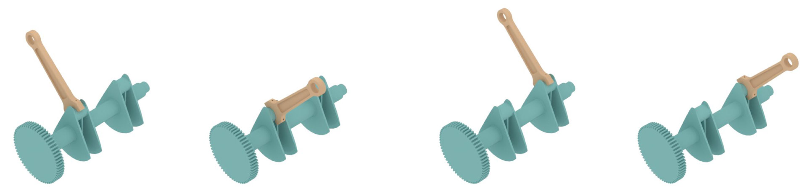
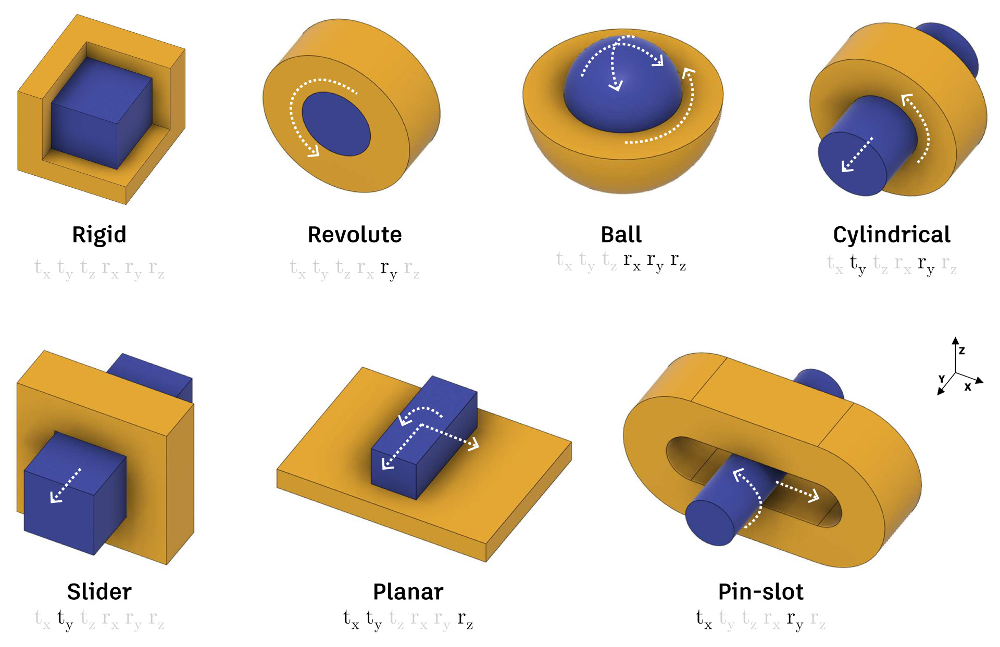

# Assembly Dataset - Joint Data
The Assembly Dataset joint data contains pairs of parts, with one or more joints defined between, extracted from CAD assemblies. We provide the joint data separate from the assembly data as an accessible standalone dataset for joint prediction. 


## Overview
The best practice for CAD assembly is to define relative relationships between pairs of parts, to form joints, also known as _mates_. Joints define the degrees of freedom between the two parts, the parameters for a rest state pose, and the overall motion limits. CAD users select B-Rep faces and edges, i.e. entities, on each part to define how the two parts are assembled.


The joint data consists of 19,156 joint sets, containing 32,148 joints between 23,029 different parts. An example of a joint set is shown below and consists of a unique pair of parts with one or more joints defining how they are locally constrained and positioned together. We consider a joint set to be a single data sample.



## Data Formats
The joint data contains 3D models in the B-Rep and mesh representations. Joint parameter information is stored in a JSON file. We also provide the graph representation used by _JoinABLe_. Other representations, such as point clouds or voxels, can be generated using existing data conversion routines and are not included in the dataset. Files are provided in a single directory, with the joint set file, named using the convention `joint_set_XXXXX.json`, referencing the 3D model files of the two parts. For convenience we include a thumbnail .png image file, named `joint_set_XXXXX.png`, depicting the first joint of the joint set in an assembled state. 

### B-Rep
B-Rep data is provided as .smt files representing the ground truth geometry and .step as an alternate neutral B-Rep file format. The .smt file format is the native format used by Autodesk Shape Manager, the CAD kernel within Fusion 360, and has the advantage of minimizing conversion errors. The B-Rep entities, such as faces and edges, can referenced by index from the JSON back to entities in the .smt file.

### Mesh
Mesh data is provided in .obj format representing a triangulated version of the B-Rep. Triangles belonging to each B-Rep faces are denoted in the .obj file as groups, for example, `g face 1`, indicates the next series of triangles in the file belong to the B-Rep face with index 1. B-Rep edges are converted to poly lines and added to the .obj file. The B-Rep edge and half-edge index is also denoted, for example, `g halfedge 7 edge 3`.  Using these group indices it is possible to map directly from B-Rep faces and edges to mesh triangles and poly lines. Note that meshes provided in the dataset are not guaranteed to be manifold. 

### Graph
In the graph data each node represents a B-Rep face or edge, with the graph edges defined by adjacency. We include the input features used by _JoinABLe_ as well as the UV-grid features (points, normals, trimming mask, tangents) proposed by [UV-Net](https://github.com/AutodeskAILab/UV-Net). We store the graph data as a JSON file in the [NetworkX](https://networkx.org) node-link data format for easy integration with common graph neural network frameworks. The node order stored in the JSON enumerates all B-Rep faces then all B-Rep edges.


### Joint Set JSON
Joint parameter information is stored in the joint set JSON file. The top level data elements are as follows:

```js

{
    "body_one": "40352_a9774a3f_0044_1",
    "body_two": "40352_a9774a3f_0044_2",
    "joints": [...],
    "contacts": [...],
    "holes": [...]
}
```
Here `body_one` and `body_two` reference the pair of 3D model files used to form the joint. These files exist in the same directory with the appropriate file extension e.g. `.obj`. Below we describe in further detail the contents of the `joints`, `contacts`, and `holes` lists.

### Units
All units are provided in cm, including 3D model geometry and distance parameters stored in the JSON files. Angular units are provided in radians.


## Joints
The `joints` list contains joint parameter information that follows the Fusion 360 [`Joint`](https://help.autodesk.com/cloudhelp/ENU/Fusion-360-API/files/Joint.htm) class. Each entry defines a joint between the two parts with the following data structure:

```js
"joints": [
    {
        "name": "Rev40",
        "type": "Joint",
        "joint_motion": {...},
        "geometry_or_origin_one": {...},
        "geometry_or_origin_two": {...},
        "offset": {...},
        "angle": {...},
        "is_flipped": false
    },
    ...
]
```
A high level overview of the joint parameter information is provided below.

### Joint Motion
Fusion 360 has seven different types of joints, each with associated joint motion information defining the degrees of freedom, motion axes, motion limits, and rest state:

- [`RigidJointType`](https://help.autodesk.com/cloudhelp/ENU/Fusion-360-API/files/RigidJointMotion.htm)
- [`RevoluteJointType`](https://help.autodesk.com/cloudhelp/ENU/Fusion-360-API/files/RevoluteJointMotion.htm)
- [`SliderJointType`](https://help.autodesk.com/cloudhelp/ENU/Fusion-360-API/files/SliderJointMotion.htm)
- [`CylindricalJointType`](https://help.autodesk.com/cloudhelp/ENU/Fusion-360-API/files/CylindricalJointMotion.htm)
- [`PinSlotJointType`](https://help.autodesk.com/cloudhelp/ENU/Fusion-360-API/files/PinSlotJointMotion.htm)
- [`PlanarJointType`](https://help.autodesk.com/cloudhelp/ENU/Fusion-360-API/files/PlanarJointMotion.htm)
- [`BallJointType`](https://help.autodesk.com/cloudhelp/ENU/Fusion-360-API/files/BallJointMotion.htm)



An example `joint_motion` entry for a [`RevoluteJointType`](https://help.autodesk.com/cloudhelp/ENU/Fusion-360-API/files/RevoluteJointMotion.htm) is shown below:
```js
"joint_motion": {
    "joint_type": "RevoluteJointType",
    "rotation_axis": "ZAxisJointDirection",
    "rotation_limits": {
        "maximum_value": 0.0,
        "minimum_value": 0.0,
        "rest_value": 0.0,
        "is_maximum_value_enabled": false,
        "is_minimum_value_enabled": false,
        "is_rest_value_enabled": false
    }
},
```


### Joint Geometry
Designer-selected B-Rep faces and edges, form the geometric entites used to define joints. The `geometry_or_origin_one` and `geometry_or_origin_two` data structures provide information about these B-Rep face and edge entities. The [`JointGeometry`](https://help.autodesk.com/cloudhelp/ENU/Fusion-360-API/files/JointGeometry.htm) class can be referenced for full details. The `entity_one` data structure within each `geometry_or_origin_*`, contains an `index` value that indexes into the B-Rep faces or edges in the native .smt files or the triangle or poly line groups in the .obj mesh files. The image below highlights these entities in cyan, while the pink entities share the same joint axis and are also provided as `entity_one_equivalents`. 


In addition to the B-Rep entities, the `axis_line`, shown in yellow above, contains the `origin` point and `direction` vector on the joint axis when in an assembled state. The `transform` represents the rigid body transform that mates `body_one` to `body_two` into an assembled state. The `transform` is given as a coordinate system.

An example entry for `geometry_or_origin_one` is shown below:

```js
"geometry_or_origin_one": {
    "type": "JointGeometry",
    "geometry_type": "JointBRepEdgeGeometry",
    "key_point_type": "CenterKeyPoint",
    "origin": {...},
    "primary_axis_vector": {...},
    "secondary_axis_vector": {...},
    "tertiary_axis_vector": {...},
    "entity_one": {
        "type": "BRepEdge",
        "body": "38120_b4f25309_0033_1",
        "curve_type": "Circle3DCurveType",
        "point_on_entity": {...},
        "index": 1,
        "bounding_box": {...},
        "id": 0
    },
    "transform": {...},
    "axis_line": {
        "origin": {
            "type": "Point3D",
            "x": 1.0,
            "y": 221.0,
            "z": 347.0
        },
        "direction": {
            "type": "Vector3D",
            "x": 1.0,
            "y": 2.220446049250313e-16,
            "z": -2.7192621468937827e-32,
            "length": 1.0
        }
    },
    "entity_one_equivalents": [...]
},

```


### Joint Parameters
The following designer-defined joint parameters are also provided:
- [`offset`](https://help.autodesk.com/cloudhelp/ENU/Fusion-360-API/files/Joint_offset.htm): The offset between the two input geometries.
- [`angle`](https://help.autodesk.com/cloudhelp/ENU/Fusion-360-API/files/Joint_angle.htm): The angle between the two input geometries.
- [`is_flipped`](https://help.autodesk.com/cloudhelp/ENU/Fusion-360-API/files/Joint_isFlipped.htm): If the joint direction is flipped or not.


## Contacts
The `contacts` list provides contact labels that indicate which B-Rep faces are coincident or within a tolerance of 0.1mm, when a joint is in an assembled state.  An example of a contact is shown below with the surfaces in contact highlighted in red. Each entry in the contacts list contains a pair of entities, `entity_one` and `entity_two`, indicating which faces are in contact when assembled with a given joint, definded by the `joint_index` which indexes into the `joints` list. Each entity includes information about the body it belongs to, the type of surface in contact (cylindrical, planar, etc.), the bounding box surrounding the entity, and an index that can be used to uniquely identify the B-Rep face.


An example entry in the `contacts` list is shown below:

```js
"contacts": [
    {
        "entity_one": {
            "type": "BRepFace",
            "body": "38120_b4f25309_0033_1",
            "surface_type": "PlaneSurfaceType",
            "point_on_entity": {...},
            "index": 2,
            "bounding_box": {...},
            "id": 4
        },
        "entity_two": {...},
        "joint_index": 0
    }
    ...
]
```


## Holes
In CAD models, holes are common design features that often serve a specific purpose. Parts are commonly held together with bolts and screws, which either pass through or end in holes in the parts. As holes are an important design feature, we use the Autodesk Shape Manager feature recognition tool to identify and label holes in each part. Each hole lists information about the body it is in, diameter, length, direction, and faces and edges that belong to the hole. Holes are also labeled with a hole type denoting the shape at the hole entrance and at the end of the hole:

- `RoundHoleWithBlindBottom`
- `RoundBlindHoleWithConicalBottom`
- `RoundBlindHoleWithSphericalBottom`
- `RoundBlindHoleWithTaperedBottom`
- `RoundHoleWithThroughBottom`
- `TaperedRoundHoleWithBlindBottom`
- `TaperedRoundHoleWithThroughBottom`
- `CounterboreBlindHole`
- `CounterboreBlindHoleWithConicalBottom`
- `CounterboreBlindHoleWithSphericalBottom`
- `CounterboreBlindHoleWithTaperedBottom`
- `CounterboreThroughHole`
- `TaperedCounterboreBlindHole`
- `TaperedCounterboreHoleWithThroughBottom`
- `CountersunkHoleWithBlindBottom`
- `CountersunkBlindHoleWithConicalBottom`
- `CountersunkBlindHoleWithSphericalBottom`
- `CountersunkBlindHoleWithTaperedBottom`
- `CountersunkHoleWithThroughBottom`
- `CountersunkCounterboreBlindHole`
- `CountersunkCounterboreBlindHoleWithConicalBottom`
- `CountersunkCounterboreBlindHoleWithSphericalBottom`
- `CountersunkCounterboreBlindHoleWithTaperedBottom`
- `CountersunkCounterboreThroughHole`

An example entry in the `holes` list is shown below:

```js
{
    "holes": [
        {
            "type": "RoundHoleWithThroughBottom",
            "body": "51a00400-0573-11ec-9601-06368d9f66a5",
            "diameter": 0.6000000000000001,
            "length": 0.3999999999999999,
            "origin": {...},
            "direction": {...},
            "faces": [...],
            "edges": [...]
        },
        ...
    ]
}
```

## Train/Test Split
The official train/test split is contained in the file `train_test.json`. We provide an approximate 70/10/10/10% data split, for the train, validation, test, and original distribution test sets respectively. 


