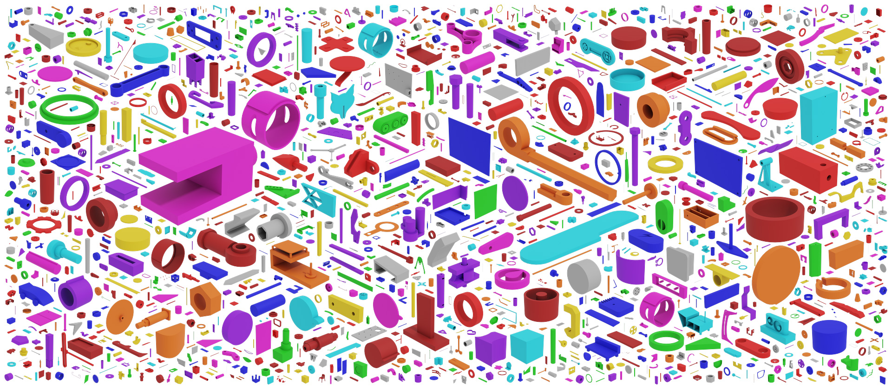
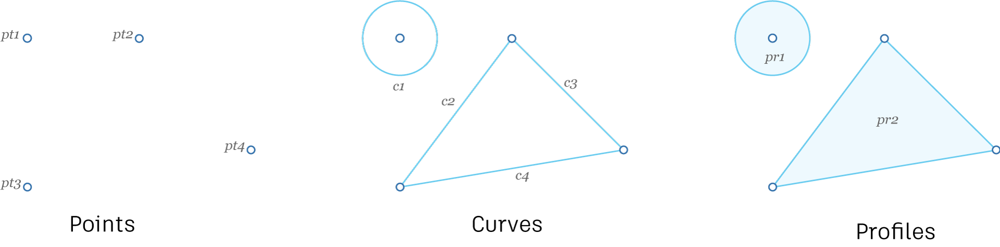
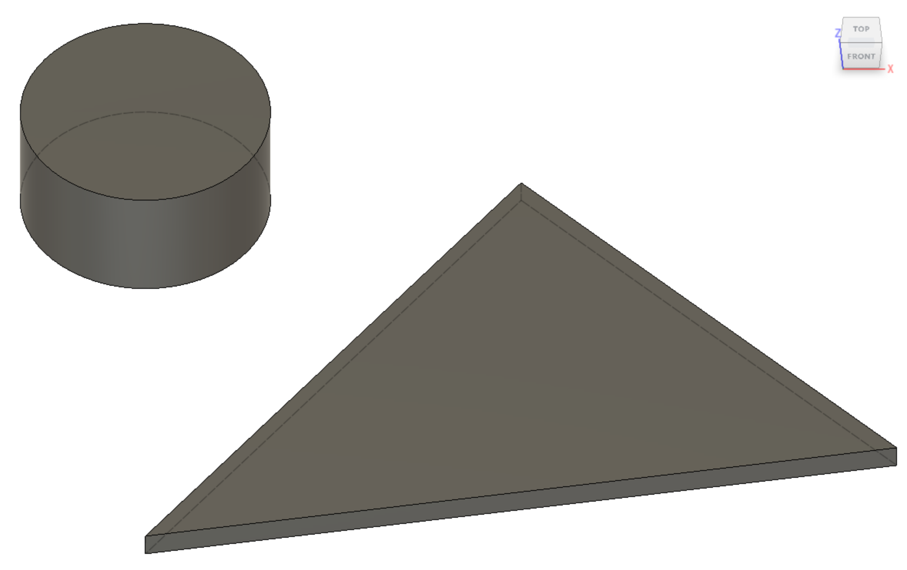
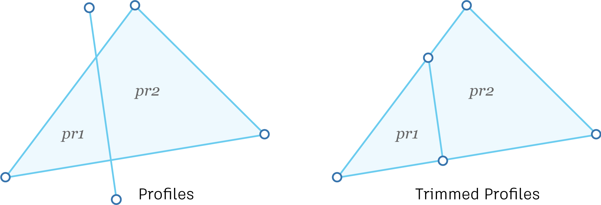

# Reconstruction Subset
The Reconstruction Subset contains sequential design data from a subset of simple 'sketch and extrude' components that enables final geometry to be reconstructed.



## Overview
Reconstruction data is extracted in sequence from CAD modeling operations found in the parametric feature timeline of each Fusion 360 CAD model. Although there are many CAD modeling operations, we intentionally limit the data to the *sketch* and *extrude* operations to reduce the complexity of the reconstruction task. By replaying the sequence of modeling operations programmatically in Fusion 360 it is possible to reconstruct the original model. 

### Sketch
We represent each sketch as a series of points, that create curves, that in turn create profiles. Curves can range from a simple line, to a circle, to arcs and splines. Profiles are closed loops formed from one or more curves.



### Extrude
An extrude operation takes one or more sketch profiles and constructs a 3D shape. The distance parameter defines how far the profile is extruded. Various options for the type of extrude operation are outlined in more detail below.




## Data Formats
The reconstruction subset contains a total of 7,706 3D models in three different representations: B-Rep, mesh, and construction sequence saved in the json format. B-Rep data is provided in .smt files representing the ground truth geometry. Mesh data is provided in .obj format representing a triangulated version of ground truth geometry.

## Construction Sequence
Construction information is provided in a .json format that allows for designs to be reconstructed with Fusion 360 to match the original geometry. 

### Timeline
When a user is designing in Fusion 360, CAD modelling operations are recorded in a timeline along with the parameters specified by the user at each step. 


We represent the timeline as a sequantial list with an `index` and an `entity`. The `index` represents when in the overall assembly timeline the sketch or extrude operation was performed. The entity is a uuid value to look up the sketch or extrude data in the `entities` data structure.

```json
"timeline": [
    {
        "index": 0,
        "entity": "ed84457a-965f-11ea-911a-acde48001122"
    },
    {
        "index": 1,
        "entity": "ed86b6a2-965f-11ea-911a-acde48001122"
    },
    {
        "index": 2,
        "entity": "ed86ca98-965f-11ea-911a-acde48001122"
    },
    {
        "index": 3,
        "entity": "ed8bae3c-965f-11ea-911a-acde48001122"
    }
]
```

### Entities
The `entities` data structure contains the details of the sketch and extrude operations detailed in the timeline. Each entity has a `name` and a `type`. The `name` is assigned usually assigned automatically in Fusion 360 but could also be in a localized version. The `type` represents the CAD operation and will be either `Sketch` or `ExtrudeFeature`.

```json
"entities": {
    "ed84457a-965f-11ea-911a-acde48001122": {
        "name": "Sketch1",
        "type": "Sketch"
    },
    "ed86b6a2-965f-11ea-911a-acde48001122": {
        "name": "Extrude1",
        "type": "ExtrudeFeature"
    }
}
```

### Sketch Entities
Sketch entities reflect the Fusion API [`Sketch`](http://help.autodesk.com/cloudhelp/ENU/Fusion-360-API/files/Sketch.htm). A high level overview of the data structure is provided below, but please refer to the Fusion API documentation for low level details. A sketch entity contains the following top level data structures:

```json
"entities": {
    "ed84457a-965f-11ea-911a-acde48001122": {
        "name": "Sketch1",
        "type": "Sketch",
        "points": { },
        "curves": { },
        "constraints": { },
        "profiles": { },
        "transform": { },
        "reference_plane": { }
    }
}
```

#### Points
Each point is provided with a uuid key and a [`Point3D`](http://help.autodesk.com/cloudhelp/ENU/Fusion-360-API/files/Point3D.htm) data structure. Sketch data is drawn in a local coordinate system, so only the `x` and `y` values will be populated.
```json
"ed85d386-965f-11ea-911a-acde48001122": {
    "type": "Point3D",
    "x": 4.0,
    "y": 2.0,
    "z": 0.0
}
```


#### Curves
Each curve has a uuid key and a [`SketchCurve`](https://help.autodesk.com/cloudhelp/ENU/Fusion-360-API/files/SketchCurve.htm) that can represent a number of different curve types: [`SketchArc`](https://help.autodesk.com/cloudhelp/ENU/Fusion-360-API/files/SketchArc.htm), [`SketchCircle`](https://help.autodesk.com/cloudhelp/ENU/Fusion-360-API/files/SketchCircle.htm), [`SketchConicCurve`](https://help.autodesk.com/cloudhelp/ENU/Fusion-360-API/files/SketchConicCurve.htm), [`SketchEllipse`](https://help.autodesk.com/cloudhelp/ENU/Fusion-360-API/files/SketchEllipse.htm), [`SketchEllipticalArc`](https://help.autodesk.com/cloudhelp/ENU/Fusion-360-API/files/SketchEllipticalArc.htm), [`SketchFittedSpline`](https://help.autodesk.com/cloudhelp/ENU/Fusion-360-API/files/SketchFittedSpline.htm), [`SketchFixedSpline`](https://help.autodesk.com/cloudhelp/ENU/Fusion-360-API/files/SketchFixedSpline.htm), [`SketchLine`](https://help.autodesk.com/cloudhelp/ENU/Fusion-360-API/files/SketchLine.htm). Shown below is a simple example of a `SketchLine` that has a `start_point` and `end_point` uuid referencing the `points` data structure.
```json
"ed85413c-965f-11ea-911a-acde48001122": {
    "type": "SketchLine",
    "construction_geom": false,
    "fixed": false,
    "fully_constrained": false,
    "reference": false,
    "visible": true,
    "start_point": "ed85e27c-965f-11ea-911a-acde48001122",
    "end_point": "ed85f460-965f-11ea-911a-acde48001122"
}
```

#### Constraints
Constraints are used to control how the sketch is generated when parameters are changed. Each constraint has a uuid key and a [`GeometricConstraint`](https://help.autodesk.com/cloudhelp/ENU/Fusion-360-API/files/GeometricConstraint.htm) that can represent a number of different constraint types that are applied to curves: [`CircularPatternConstraint`](https://help.autodesk.com/cloudhelp/ENU/Fusion-360-API/files/CircularPatternConstraint.htm), [`CoincidentConstraint`](https://help.autodesk.com/cloudhelp/ENU/Fusion-360-API/files/CoincidentConstraint.htm), [`CollinearConstraint`](https://help.autodesk.com/cloudhelp/ENU/Fusion-360-API/files/CollinearConstraint.htm), [`ConcentricConstraint`](https://help.autodesk.com/cloudhelp/ENU/Fusion-360-API/files/ConcentricConstraint.htm), [`EqualConstraint`](https://help.autodesk.com/cloudhelp/ENU/Fusion-360-API/files/EqualConstraint.htm), [`HorizontalConstraint`](https://help.autodesk.com/cloudhelp/ENU/Fusion-360-API/files/HorizontalConstraint.htm), [`HorizontalPointsConstraint`](https://help.autodesk.com/cloudhelp/ENU/Fusion-360-API/files/HorizontalPointsConstraint.htm), [`MidPointConstraint`](https://help.autodesk.com/cloudhelp/ENU/Fusion-360-API/files/MidPointConstraint.htm), [`OffsetConstraint`](https://help.autodesk.com/cloudhelp/ENU/Fusion-360-API/files/OffsetConstraint.htm), [`ParallelConstraint`](https://help.autodesk.com/cloudhelp/ENU/Fusion-360-API/files/ParallelConstraint.htm), [`PerpendicularConstraint`](https://help.autodesk.com/cloudhelp/ENU/Fusion-360-API/files/PerpendicularConstraint.htm), [`PolygonConstraint`](https://help.autodesk.com/cloudhelp/ENU/Fusion-360-API/files/PolygonConstraint.htm), [`RectangularPatternConstraint`](https://help.autodesk.com/cloudhelp/ENU/Fusion-360-API/files/RectangularPatternConstraint.htm), [`SmoothConstraint`](https://help.autodesk.com/cloudhelp/ENU/Fusion-360-API/files/SmoothConstraint.htm), [`SymmetryConstraint`](https://help.autodesk.com/cloudhelp/ENU/Fusion-360-API/files/SymmetryConstraint.htm), [`TangentConstraint`](https://help.autodesk.com/cloudhelp/ENU/Fusion-360-API/files/TangentConstraint.htm), [`VerticalConstraint`](https://help.autodesk.com/cloudhelp/ENU/Fusion-360-API/files/VerticalConstraint.htm), [`VerticalPointsConstraint`](https://help.autodesk.com/cloudhelp/ENU/Fusion-360-API/files/VerticalPointsConstraint.htm).

```json
"ed866d8c-965f-11ea-911a-acde48001122": {
    "line": "ed85413c-965f-11ea-911a-acde48001122",
    "type": "HorizontalConstraint"
}
```

#### Profiles
Profiles represent a collection of curves that joint together to make a closed loop. In Fusion 360 profiles are automatically generated from arbitrary curves that don't necessarily connect at the end points. In the example below two profiles (`pr1` and `pr2`) are generated when the line crosses the triangle. We provide both the original curves used to generate the profiles (left) and the trimmed profile information containing just the closed profile loop.



The overall structure for a profile is as follows.

```json
"0e0d3220-8e8c-3fd7-b7ad-cba4eca5ed74": {
    "loops": [
        {
            "is_outer": true,
            "profile_curves": []
        }
    ],
    "properties": { }
}
```


#### Transform

#### Reference Plane


### Extrude Entities