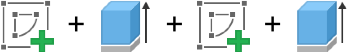

# Reconstruction Subset
The Reconstruction Subset contains sequential design data from a subset of simple 'sketch and extrude' components that enables final geometry to be reconstructed.


## Overview
Reconstruction data is extracted in sequence from CAD modeling operations found in the parametric feature timeline of each Fusion 360 CAD model. Although there are many CAD modeling operations, we intentionally limit the data to the *sketch* and *extrude* operations to reduce the complexity of the reconstruction task. By replaying the sequence of modeling operations programmatically in Fusion 360 it is possible to reconstruct the original model. 

### Sketch
Sketch data is represented as a series of points, that create curves, that in turn create profiles. Curves can range from a simple line, to a circle, to arcs and splines. Profiles are closed loops formed from one or more curves.


### Extrude
An extrude operation takes one or more sketch profiles and constructs a 3D shape. Various parameters inform how the extrude operation is created, such as the direction, distance, and operation type. In the example design sequence below, sketch profiles are sequentially extruded to _join_ (Extrude 1, Extrude 2) or _cut_ (Extrude 3) geometry using built in boolean operations. The color coded areas show the sketch profiles that partake in each extrude operation.


## Data Formats
The reconstruction subset contains 3D models in three different representations: B-Rep, mesh, and construction sequence saved in JSON text format. Other representations, such as point clouds or voxels, can be generated using existing data conversion routines and are not included in the dataset. For convenience we include a thumbnail .png image file together with each geometry. Files are provided in a single directory, with a naming convention as follows: `XXXXX_YYYYYYYY_ZZZZ[_1234].ext`. Here `XXXXX` represents the project, `YYYYYYYY` the file, `ZZZZ` the component, and `_1234` the extrude index. If `_1234` is absent the file represents the final design.

### B-Rep
B-Rep data is provided as .smt files representing the ground truth geometry and .step as an alternate neutral B-Rep file format. The .smt file format is the native format used by Autodesk Shape Manager, the CAD kernel within Fusion 360, and has the advantage of minimizing conversion errors. Additionally the B-Rep entities, such as bodies and faces, can referenced from the construction sequence back to entities in the .smt file.

### Mesh
Mesh data is provided in .obj format representing a triangulated version of the B-Rep. Each B-Rep face is triangulated separately and labeled as a group of triangles in the .obj file with the B-Rep face id as the group name. This approach allows the triangles to be traced back to the B-Rep face and associated extrude operation. Note that the .obj meshes provided are not manifold. 

### Units
All units are provided in cm. Angular units are provided in radians.

## Construction Sequence
Construction information is provided in a .json text format that allows for designs to be reconstructed with Fusion 360 to match the original geometry. 

### Timeline
When a user is designing in Fusion 360, CAD modelling operations are recorded in a timeline along with the parameters specified by the user at each step. 



We represent the timeline as a sequantial list with an `index` and an `entity`. The `index` represents when in the overall assembly timeline the sketch or extrude operation was performed. The entity is a uuid value to look up the sketch or extrude data in the `entities` data structure.

```js
"timeline": [
    {
        "index": 0,
        "entity": "ed84457a-965f-11ea-911a-acde48001122"
    },
    {
        "index": 1,
        "entity": "ed86b6a2-965f-11ea-911a-acde48001122"
    },
    {
        "index": 2,
        "entity": "ed86ca98-965f-11ea-911a-acde48001122"
    },
    {
        "index": 3,
        "entity": "ed8bae3c-965f-11ea-911a-acde48001122"
    }
]
```

### Entities
The `entities` data structure contains the details of the sketch and extrude operations detailed in the timeline. Each entity has a `name` and a `type`. The `name` is assigned usually assigned automatically in Fusion 360 but could also be in a localized version. The `type` represents the CAD operation and will be either `Sketch` or `ExtrudeFeature`.

```js
"entities": {
    "ed84457a-965f-11ea-911a-acde48001122": {
        "name": "Sketch1",
        "type": "Sketch"
    },
    "ed86b6a2-965f-11ea-911a-acde48001122": {
        "name": "Extrude1",
        "type": "ExtrudeFeature"
    }
}
```

### Sketch
Sketch entities reflect the Fusion API [`Sketch`](http://help.autodesk.com/cloudhelp/ENU/Fusion-360-API/files/Sketch.htm). A high level overview of the data structure is provided below, but please refer to the Fusion API documentation for low level details. A sketch entity contains the following top level data structures:

```js
"ed84457a-965f-11ea-911a-acde48001122": {
    "name": "Sketch1",
    "type": "Sketch",
    "points": { },
    "curves": { },
    "constraints": { },
    "profiles": { },
    "transform": { },
    "reference_plane": { }
}
```

#### Points
Each point is provided with a uuid key and a [`Point3D`](http://help.autodesk.com/cloudhelp/ENU/Fusion-360-API/files/Point3D.htm) data structure. Sketch data is drawn in a local coordinate system, so only the `x` and `y` values will be populated.
```js
"ed85d386-965f-11ea-911a-acde48001122": {
    "type": "Point3D",
    "x": 4.0,
    "y": 2.0,
    "z": 0.0
}
```


#### Curves
Each curve has a uuid key and a [`SketchCurve`](https://help.autodesk.com/cloudhelp/ENU/Fusion-360-API/files/SketchCurve.htm) that can represent a number of different curve types:
- [`SketchArc`](https://help.autodesk.com/cloudhelp/ENU/Fusion-360-API/files/SketchArc.htm) 
- [`SketchCircle`](https://help.autodesk.com/cloudhelp/ENU/Fusion-360-API/files/SketchCircle.htm) 
- [`SketchConicCurve`](https://help.autodesk.com/cloudhelp/ENU/Fusion-360-API/files/SketchConicCurve.htm) 
- [`SketchEllipse`](https://help.autodesk.com/cloudhelp/ENU/Fusion-360-API/files/SketchEllipse.htm) 
- [`SketchEllipticalArc`](https://help.autodesk.com/cloudhelp/ENU/Fusion-360-API/files/SketchEllipticalArc.htm) 
- [`SketchFittedSpline`](https://help.autodesk.com/cloudhelp/ENU/Fusion-360-API/files/SketchFittedSpline.htm) 
- [`SketchFixedSpline`](https://help.autodesk.com/cloudhelp/ENU/Fusion-360-API/files/SketchFixedSpline.htm) 
- [`SketchLine`](https://help.autodesk.com/cloudhelp/ENU/Fusion-360-API/files/SketchLine.htm)

Shown below is a simple example of a `SketchLine` that has a `start_point` and `end_point` uuid referencing the `points` data structure.
```js
"ed85413c-965f-11ea-911a-acde48001122": {
    "type": "SketchLine",
    "construction_geom": false,
    "fixed": false,
    "fully_constrained": false,
    "reference": false,
    "visible": true,
    "start_point": "ed85e27c-965f-11ea-911a-acde48001122",
    "end_point": "ed85f460-965f-11ea-911a-acde48001122"
}
```

#### Constraints
Constraints are used to control how the sketch is generated when parameters are changed. Each constraint has a uuid key and a [`GeometricConstraint`](https://help.autodesk.com/cloudhelp/ENU/Fusion-360-API/files/GeometricConstraint.htm) that can represent a number of different constraint types that are applied to curves: 
- [`CircularPatternConstraint`](https://help.autodesk.com/cloudhelp/ENU/Fusion-360-API/files/CircularPatternConstraint.htm) 
- [`CoincidentConstraint`](https://help.autodesk.com/cloudhelp/ENU/Fusion-360-API/files/CoincidentConstraint.htm) 
- [`CollinearConstraint`](https://help.autodesk.com/cloudhelp/ENU/Fusion-360-API/files/CollinearConstraint.htm) 
- [`ConcentricConstraint`](https://help.autodesk.com/cloudhelp/ENU/Fusion-360-API/files/ConcentricConstraint.htm) 
- [`EqualConstraint`](https://help.autodesk.com/cloudhelp/ENU/Fusion-360-API/files/EqualConstraint.htm) 
- [`HorizontalConstraint`](https://help.autodesk.com/cloudhelp/ENU/Fusion-360-API/files/HorizontalConstraint.htm) 
- [`HorizontalPointsConstraint`](https://help.autodesk.com/cloudhelp/ENU/Fusion-360-API/files/HorizontalPointsConstraint.htm) 
- [`MidPointConstraint`](https://help.autodesk.com/cloudhelp/ENU/Fusion-360-API/files/MidPointConstraint.htm) 
- [`OffsetConstraint`](https://help.autodesk.com/cloudhelp/ENU/Fusion-360-API/files/OffsetConstraint.htm) 
- [`ParallelConstraint`](https://help.autodesk.com/cloudhelp/ENU/Fusion-360-API/files/ParallelConstraint.htm) 
- [`PerpendicularConstraint`](https://help.autodesk.com/cloudhelp/ENU/Fusion-360-API/files/PerpendicularConstraint.htm) 
- [`PolygonConstraint`](https://help.autodesk.com/cloudhelp/ENU/Fusion-360-API/files/PolygonConstraint.htm) 
- [`RectangularPatternConstraint`](https://help.autodesk.com/cloudhelp/ENU/Fusion-360-API/files/RectangularPatternConstraint.htm) 
- [`SmoothConstraint`](https://help.autodesk.com/cloudhelp/ENU/Fusion-360-API/files/SmoothConstraint.htm) 
- [`SymmetryConstraint`](https://help.autodesk.com/cloudhelp/ENU/Fusion-360-API/files/SymmetryConstraint.htm) 
- [`TangentConstraint`](https://help.autodesk.com/cloudhelp/ENU/Fusion-360-API/files/TangentConstraint.htm) 
- [`VerticalConstraint`](https://help.autodesk.com/cloudhelp/ENU/Fusion-360-API/files/VerticalConstraint.htm) 
- [`VerticalPointsConstraint`](https://help.autodesk.com/cloudhelp/ENU/Fusion-360-API/files/VerticalPointsConstraint.htm)

```js
"ed866d8c-965f-11ea-911a-acde48001122": {
    "line": "ed85413c-965f-11ea-911a-acde48001122",
    "type": "HorizontalConstraint"
}
```

#### Dimensions
Dimensions are defined by the user to set angles, diameters, distances etc... between sketch geometry to constraint the sketch as it is edited. Each dimension has a uuid key and a [`SketchDimension`](https://help.autodesk.com/cloudhelp/ENU/Fusion-360-API/files/SketchDimension.htm) representing a dimension type such as:
- [`SketchAngularDimension`](https://help.autodesk.com/cloudhelp/ENU/Fusion-360-API/files/SketchAngularDimension.htm) 
- [`SketchConcentricCircleDimension`](https://help.autodesk.com/cloudhelp/ENU/Fusion-360-API/files/SketchConcentricCircleDimension.htm) 
- [`SketchDiameterDimension`](https://help.autodesk.com/cloudhelp/ENU/Fusion-360-API/files/SketchDiameterDimension.htm) 
- [`SketchEllipseMajorRadiusDimension`](https://help.autodesk.com/cloudhelp/ENU/Fusion-360-API/files/SketchEllipseMajorRadiusDimension.htm) 
- [`SketchEllipseMinorRadiusDimension`](https://help.autodesk.com/cloudhelp/ENU/Fusion-360-API/files/SketchEllipseMinorRadiusDimension.htm) 
- [`SketchLinearDimension`](https://help.autodesk.com/cloudhelp/ENU/Fusion-360-API/files/SketchLinearDimension.htm) 
- [`SketchOffsetCurvesDimension`](https://help.autodesk.com/cloudhelp/ENU/Fusion-360-API/files/SketchOffsetCurvesDimension.htm) 
- [`SketchOffsetDimension`](https://help.autodesk.com/cloudhelp/ENU/Fusion-360-API/files/SketchOffsetDimension.htm) 
- [`SketchRadialDimension`](https://help.autodesk.com/cloudhelp/ENU/Fusion-360-API/files/SketchRadialDimension.htm)

The example below describes a linear dimension of 5.27 cm between two points.

```js
"6bac825c-c842-11ea-af4b-54bf646e7e1f": {
    "parameter": {
        "type": "ModelParameter",
        "value": 5.27451897,
        "name": "d2",
        "role": "Linear Dimension-2"
    },
    "text_position": {
        "type": "Point3D",
        "x": -6.666826879191981,
        "y": -3.1769168442187983,
        "z": 0.0
    },
    "is_driving": true,
    "entity_one": "6bab9808-c842-11ea-8db0-54bf646e7e1f",
    "entity_two": "6babbf08-c842-11ea-8cac-54bf646e7e1f",
    "orientation": "AlignedDimensionOrientation",
    "type": "SketchLinearDimension"
}
```


#### Profiles
Profiles represent a collection of curves that joint together to make a closed loop. In Fusion 360 profiles are automatically generated from arbitrary curves that don't necessarily connect at the end points. In the example below two profiles (`pr1` and `pr2`) are generated when the line crosses the triangle. We provide both the original curves used to generate the profiles (bottom left) and the trimmed profile information containing just the closed profile loop (bottom right).


The overall structure for a profile is as follows. Inside `profile_curves` the reference to the `curve` uuid points to the original curve that created the profile. The remaining data specifies the trimmed curve segments that form a connected loop. 

```js
"0e0d3220-8e8c-3fd7-b7ad-cba4eca5ed74": {
    "loops": [
        {
            "is_outer": true,
            "profile_curves": [
                {
                    "type": "Line3D",
                    "start_point": {
                        "type": "Point3D",
                        "x": 4.000000059604645,
                        "y": 3.0000000447034836,
                        "z": 0.0
                    },
                    "end_point": {
                        "type": "Point3D",
                        "x": 4.000000059604645,
                        "y": 0.0,
                        "z": 0.0
                    },
                    "curve": "ea667aee-e6ef-11ea-8960-acde48001122"
                },
                {
                    ...
                }
            ]
        }
    ],
    "properties": { }
}
```

#### Transform
The transform of the sketch with respect to model space. See [`Sketch.transform`](https://help.autodesk.com/cloudhelp/ENU/Fusion-360-API/files/Sketch_transform.htm). Provided as a [coordinate system](https://help.autodesk.com/cloudhelp/ENU/Fusion-360-API/files/Matrix3D_getAsCoordinateSystem.htm).


#### Reference Plane
The reference plane the sketch is associated to. See [`Sketch.referencePlane`](https://help.autodesk.com/cloudhelp/ENU/Fusion-360-API/files/Sketch_referencePlane.htm). The refererence plane can originate from a [`ConstructionPlane`](https://help.autodesk.com/cloudhelp/ENU/Fusion-360-API/files/BRepFace.htm) (such as a canonical XY, YZ, or YZ construction plane), a planar [`BRepFace`](https://help.autodesk.com/view/fusion360/ENU/?guid=BRepFace), or a [`Profile`](https://help.autodesk.com/cloudhelp/ENU/Fusion-360-API/files/Profile.htm).


### Extrude
Extrude entities reflect the Fusion API [`ExtrudeFeature`](https://help.autodesk.com/cloudhelp/ENU/Fusion-360-API/files/ExtrudeFeature.htm). A high level overview of the data structure is provided below, but please refer to the Fusion API documentation for low level details. An extrude entity contains the following top level data structures:

```js
"ea69e774-e6ef-11ea-8960-acde48001122": {
    "name": "Extrude1",
    "type": "ExtrudeFeature",
    "profiles": [ ],
    "operation": "NewBodyFeatureOperation",
    "start_extent": { },
    "extent_type": "OneSideFeatureExtentType",
    "extent_one": { },
    "faces": { },
    "bodies": { },
    "extrude_bodies": [ ],
    "extrude_faces": [ ],
    "extrude_side_faces": [ ],
    "extrude_end_faces": [ ],
    "extrude_start_faces": [ ]
},
```

#### Profiles
The sketch profiles used to define the shape of the extrude. Each entry contains a reference to the `sketch` in the `entities` data structure and to the `profile` within that sketch.

```js
"profiles": [
    {
        "profile": "5bebd271-f2be-3fbf-80e0-072256cd8723",
        "sketch": "ea635c7e-e6ef-11ea-8960-acde48001122"
    }
]
```

#### Operation
The `operation` defines the type of operation performed by the extrude. See [`ExtrudeFeature.operation`](https://help.autodesk.com/cloudhelp/ENU/Fusion-360-API/files/ExtrudeFeature_operation.htm). Can be one of `JoinFeatureOperation`, `CutFeatureOperation`, `IntersectFeatureOperation`, or `NewBodyFeatureOperation`, illustrated in the figure below.


#### Start Extent
The `start_extent` defines the "extent" used to define the start of the extrude. See [`ExtrudeFeature.startExtent`](https://help.autodesk.com/cloudhelp/ENU/Fusion-360-API/files/ExtrudeFeature_startExtent.htm). Can be one of `ProfilePlaneStartDefinition` or `OffsetStartDefinition`. With `ProfilePlaneStartDefinition` the extrude starts at the sketch profile, while with `OffsetStartDefinition` it is offset by a given distance from the sketch profile.

#### Extent Type
The `extent_type` defines the type of "extent" used for with the extrude. See [`ExtrudeFeature.extentType`](https://help.autodesk.com/cloudhelp/ENU/Fusion-360-API/files/ExtrudeFeature_extentType.htm). The image below shows how an extrude can be expressed in several different ways: perpendicular from a sketch for a set distance along one side (`OneSideFeatureExtentType`), a symmetrical distance along both sides (`SymmetricFeatureExtentType`), or separate distances along two sides (`TwoSidesFeatureExtentType`).


#### Extent One/Two
Both `extent_one` and `extent_two` define the distance and taper of the extrude. See [`ExtrudeFeature.extentOne`](https://help.autodesk.com/cloudhelp/ENU/Fusion-360-API/files/ExtrudeFeature_extentOne.htm) / [`extentTwo`](https://help.autodesk.com/cloudhelp/ENU/Fusion-360-API/files/ExtrudeFeature_extentTwo.htm). For `OneSideFeatureExtentType` and `SymmetricFeatureExtentType` only `extent_one` will be present. The `taper_angle` is provided in radians and illustrated on the right in the above image.

```js
"extent_one": {
    "distance": {
        "type": "ModelParameter",
        "value": -1.2,
        "name": "d3",
        "role": "AlongDistance"
    },
    "taper_angle": {
        "type": "ModelParameter",
        "value": 0.0,
        "name": "d4",
        "role": "TaperAngle"
    },
    "type": "DistanceExtentDefinition"
}
```


#### Faces
The `faces` data structure contains a list of **all** B-Rep faces in the design at this point in the timeline. The `index` value can be used to reference the face when imported into Fusion 360 from the .smt file generated at this step in the timeline. The `surface_type` indicates the type of underlying surface represented by the face, see [`SurfaceTypes`](https://help.autodesk.com/cloudhelp/ENU/Fusion-360-API/files/SurfaceTypes.htm). `point_on_face` is a 3D point at or near the center of the face.

```js
"faces": {
    "eab25b94-e6ef-11ea-8960-acde48001122": {
        "index": 0,
        "surface_type": "PlaneSurfaceType",
        "point_on_face": {
            "type": "Point3D",
            "x": 2.0000000298023224,
            "y": 0.30000000447034836,
            "z": 1.6
        }
    },
    ...
}
```


#### Bodies
The `bodies` data structure contains a list of **all** B-Rep bodies in the design at this point in the timeline. The `index` value can be used to reference the body when imported into Fusion 360 from the .smt file generated at this step in the timeline. Each body has a list of `faces`, containing uuids, that reference the `faces` list at the above level. 

```js
"bodies": {
    "ea7d4e36-e6ef-11ea-8960-acde48001122": {
        "index": 0,
        "name": "Body1",
        "faces": [
            "eab25b94-e6ef-11ea-8960-acde48001122",
            ...
        ]
    }
}
```

#### Extrude Bodies and Faces
The `extrude_bodies` and `extrude_faces` lists contain references to the subset of B-Rep bodies and faces that were created from the current extrude. The `extrude_side_faces`, `extrude_end_faces`, and `extrude_start_faces` lists indicate the role of each face in the extrude. Side faces are those running perpendicular to the extrude direction. Start faces cap the end of the extrusion and are coincident with the sketch plane. End faces cap the end of the extrusion, opposite the start faces.

```js
"extrude_bodies": [
    "ea7d4e36-e6ef-11ea-8960-acde48001122"
],
"extrude_faces": [
    "eab25b94-e6ef-11ea-8960-acde48001122",
    "eab2ce80-e6ef-11ea-8960-acde48001122",
    ...
],
"extrude_side_faces": [
    "eab25b94-e6ef-11ea-8960-acde48001122",
    "eab2ce80-e6ef-11ea-8960-acde48001122",
    ...
],
"extrude_end_faces": [
    "eab5f0a6-e6ef-11ea-8960-acde48001122"
],
"extrude_start_faces": []
```


### Sequence
The sequence data structure contains a list of files and data references that are using during reconstruction. A new sequence item is added when a curve or an extrude is added to the design. Note that the as-designed ordering of sketch operations is not stored in the native design files, however this sequence represents a consistent ordering derived by traversing the sketch profiles in sequence. 
```js
"sequence": [
    {
        "index": 1,
        "type": "Sketch",
        "entity": "7bb3de62-cad8-11ea-a448-acde48001122",
        "curve": "7bb7cd38-cad8-11ea-a448-acde48001122",
        "timeline": 0
    },
    ...
    {
        "index": 9,
        "type": "ExtrudeFeature",
        "entity": "7bbbdbb2-cad8-11ea-a448-acde48001122",
        "timeline": 1,
        "png": "File_12a12060_0000_0009.png",
        "smt": "File_12a12060_0000_0009.smt",
        "obj": "File_12a12060_0000_0009.obj"
    }
]
```
Each sequence item has:
- `index`: The index in the sequence
- `type`: Either `Sketch` or `ExtrudeFeature`, indicating the modeling operation used.
- `entity`: The `uuid` key to access the entity in the `entities` data structure.
- `timeline`: The index in the timeline of the modeling operation.

Additionally curves have the following:
- `curve`: The `uuid` key to access the curve in sketch data structure.

Additionally extrudes have the following:
- `png`: A png screen capture of the design at this point in the sequence.
- `smt`: A B-Rep file in smt format of the design at this point in the sequence.
- `step`: A B-Rep file in step format of the design at this point in the sequence.
- `obj`: A mesh file in obj format of the design at this point in the sequence.
