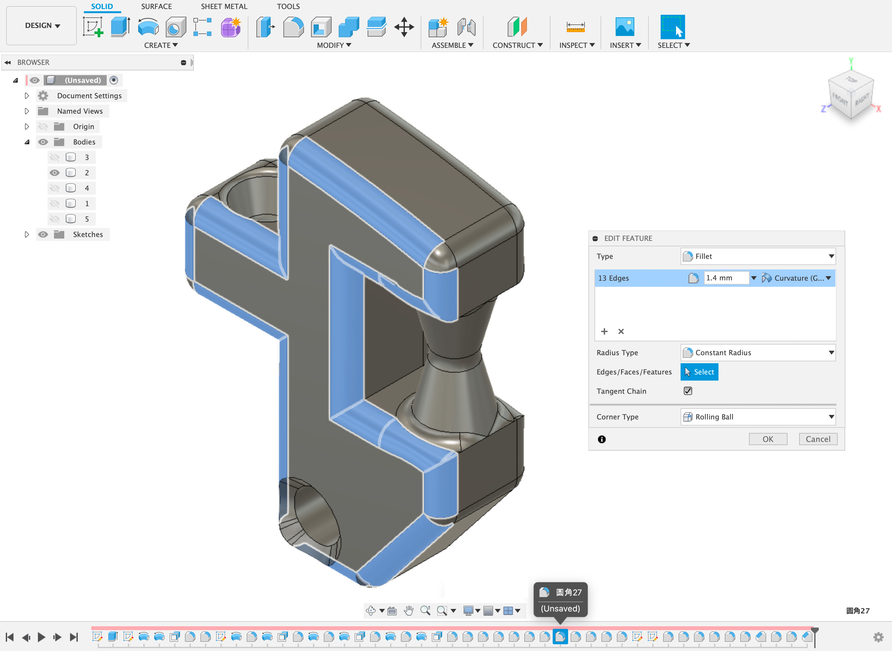
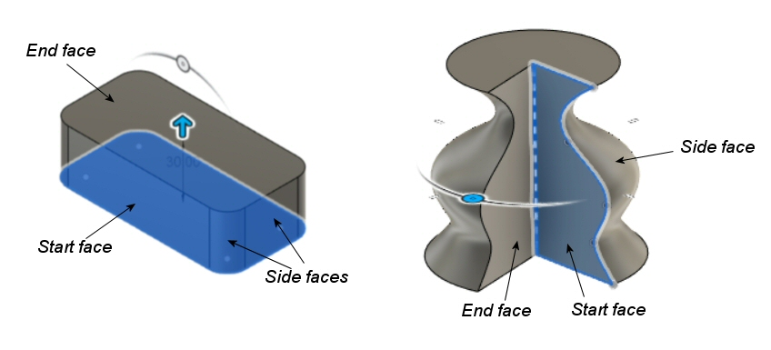
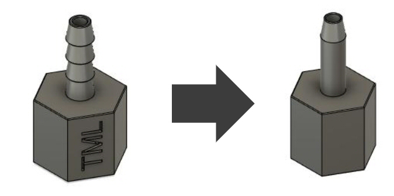
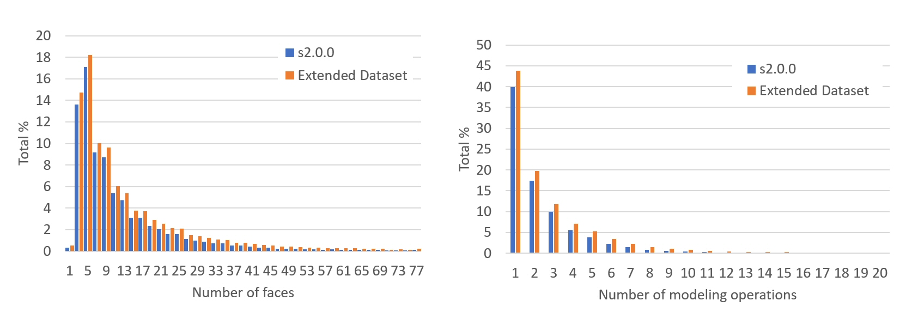

# Segmentation Dataset
The Segmentation Dataset contains a segmentation of design bodies based on the modeling operation used to create each face, e.g. Extrude, Revolve Fillet and Chamfer.


## Overview
Segmentation data is extracted from the parametric feature timeline of each Fusion 360 CAD model. We choose a small subset of the most common modeling operations: *extrude*, *chamfer*, *fillet*, and *revolve*, and record the faces that were generated by these modeling operations. 




### Labels
In order to create a segmentation which contains as much information as possible about the CAD modeling operations we further subdivide the feature categories as follows.  The faces created by extrude and revolve operations are separated according to whether they are at the side of the extrusion or at its start or end.  We also divide extrude operations into additive (i.e. adding) and subtractive (i.e. cutting) extrusion operations.


The set of eight possible labels for each face are: 
 - `ExtrudeSide`
 - `ExtrudeEnd`
 - `CutSide`
 - `CutEnd`
 - `Fillet`
 - `Chamfer`
 - `RevolveSide`
 - `RevolveEnd`


## Data Formats

The segmentation dataset contains a total of 35,680 3D models in three different representations: B-Rep, mesh, and point cloud. 

### B-Rep
The `breps` folder contains solid models (B-Rep) in two formats.  The `breps/step` folder contains STEP files which can be read and processed by many open source tools like [Open Cascade](https://github.com/tpaviot/pythonocc-core).   For an example of how to read the STEP data and generate input for a neural network see the [BRepNet](https://github.com/AutodeskAILab/BRepNet) repository.  The data processing pipeline is explained in more depth [here](https://github.com/AutodeskAILab/BRepNet/blob/master/docs/building_your_own_dataset.md).

The `breps/smt` folder contains the solids in  the Autodesk Shape Manager solid text format (.smt). These files can be read into Fusion 360 and other Autodesk products. The [Fusion 360 API](http://help.autodesk.com/view/fusion360/ENU/?guid=GUID-7B5A90C8-E94C-48DA-B16B-430729B734DC) gives extensive access to the underlying B-Rep data structure.  

Each brep file is accompanied by a segmentation file (.seg) in the `breps/seg` folder.  This is an ascii text file containing the segment indices for each face in the B-Rep data.  The same `seg`files can be used for both the `smt` and `step` data.  The file `segment_names.json` in the root folder contains segment names corresponding to each segment index.   

For an example of how to view the STEP data and segmentation see [this notebook](https://github.com/AutodeskAILab/BRepNet/blob/master/notebooks/step_viewer_example.ipynb).

### Timeline
The `timeline_info` folder contains JSON data describing the CAD modeling features which generated each B-Rep face. This information is extracted from the parametric timeline of the original design. The order of faces in the json file will match the order of faces when accessed via the Fusion 360 API. For each face we include a unique identifier for the CAD modeling feature which created it. In addition, faces generated by extrude or revolve features are marked as either start faces, end faces or side faces.

```json
"faces": [
    {
        "feature": "91e05b8a-89d0-11ea-bb1a-54bf646e7e1f",
        "location_in_feature": "SideFace"
    },
    {
        "feature": "91e05b8a-89d0-11ea-bb1a-54bf646e7e1f",
        "location_in_feature": "StartFace"
    },
    {
        "feature": "91e05b8b-89d0-11ea-a01e-54bf646e7e1f",
        "location_in_feature": "EndFace"
    }
]
```



Additional information about the CAD modeling features used to construct each model is also included in the json data.  The key for each CAD modeling feature is the unique identifier used in the faces array.  The data contains the feature's name, type and index in the timeline. 
```json
"features": {
    "91e05b8a-89d0-11ea-bb1a-54bf646e7e1f": {
        "name": "Extrude1",
        "type": "ExtrudeFeature",
        "operation": "NewBodyFeatureOperation",
        "timeline_index": 2
    },
    "91e05b8b-89d0-11ea-a01e-54bf646e7e1f": {
        "name": "Extrude2",
        "type": "ExtrudeFeature",
        "operation": "CutFeatureOperation",
        "timeline_index": 3
    },
    "91e0829c-89d0-11ea-bc45-54bf646e7e1f": {
        "name": "Chamfer1",
        "type": "ChamferFeature",
        "timeline_index": 6
    }
}
```
The feature type can be one of:
- [`ExtrudeFeature`](https://help.autodesk.com/cloudhelp/ENU/Fusion-360-API/files/ExtrudeFeature.htm)
- [`ChamferFeature`](https://help.autodesk.com/cloudhelp/ENU/Fusion-360-API/files/ChamferFeature.htm)
- [`FilletFeature`](https://help.autodesk.com/cloudhelp/ENU/Fusion-360-API/files/FilletFeature.htm)
- [`RevolveFeature`](https://help.autodesk.com/cloudhelp/ENU/Fusion-360-API/files/RevolveFeature.htm)


For extrude and revolve features we also provide the modeling operation used to combine the new geometry with the rest of the model. The operation type is defined by [`FeatureOperations`](https://help.autodesk.com/cloudhelp/ENU/Fusion-360-API/files/FeatureOperations.htm) and can be one of:
- `NewBodyFeatureOperation` 
- `JoinFeatureOperation`
- `CutFeatureOperation`
- `IntersectFeatureOperation`


### Mesh
The `meshes` folder contains high quality meshes in [`.obj` format](https://en.wikipedia.org/wiki/Wavefront_.obj_file). The meshes are guaranteed to be watertight and manifold. The accompanying `.seg` text file gives a segment index for each triangle in the obj data, corresponding to the eight labels in the `segment_names.json` file. The `.fidx` text file gives the face index for each triangle in the obj data.  These indices will point into the array of faces in the `timeline_info/*.json` files.

For an example of how to visualize the mesh data and ground truth segmentation please see [this notebook](tools/segmentation_viewer/segmentation_viewer_demo.ipynb).

### Point Cloud
The `point_clouds` folder contains point clouds with 2048 samples generated randomly with an even distribution of over the surface of the triangle mesh.  Each row of the `.xyz` files contains the `x`, `y`, `z` of the point and unit normal of the triangle the point was drawn from. The `.seg` text file gives the segment index for each point and the `.fidx` file gives the face index for each point. 

## Scaling 
All models in the dataset have been translated and scaled based on the axis aligned bounding box of the geometry.  The `smt`, `meshes` and `point_clouds` have been translated so the center of the bounding box is moved to the origin and an isotopic scaling factor applied so that the longest edge of the bounding box fits into the range [-1.0, 1.0].

Due to a unit conversion in the data exchange process, the STEP files are scaled by a factor of 10.  i.e. the longest side of the bounding box for the STEP files is [-10, 10].   See [here](https://github.com/AutodeskAILab/BRepNet/blob/master/pipeline/extract_brepnet_data_from_step.py) for an example of how to scale the STEP data into the range [-1.0, 1.0].

## Other Notes
To restrict the dataset to a limited number of segmentation classes we 'suppress' some CAD modeling features, slightly modifying the design from its original state.




## Train/Test Split
The official train/test split is contained in the file `train_test.json`.  The training set contains 30,459 models with the remaining 5,399 in the test set.

## Segmentation Extended STEP Dataset
The extended STEP dataset contains 42,912 STEP files with all the associated segmentation information (`seg` files and `timeline_info`). This includes all the STEP data from the s2.0.0, along with some models which could not be meshed with an edge count close to 2500 and consequently were not used as part of the MeshCNN baseline in the paper [BRepNet: A Topological Message Passing System for Solid Models](https://arxiv.org/abs/2104.00706).  This graph shows how the distribution of faces and modeling operations compares in the two datasets.  While the overall distributions are similar, the additional bodies added to the extended dataset help fatten the long tail of more complex models.



The extended STEP dataset is provided for the B-Rep representation only.   It is recommended for use cases where comparison with the mesh and point cloud representations are not required.  The layout of the folder is identical to s2.0.0, but the `meshes` and `point_clouds` folder is not included.

The file `additional_breps.json` contains a flat list of files which were not included in the main s2.0.0 dataset.  The file `additional_breps_train_test.json` gives the official train/test split for these additional files.   The file `train_test.json` gives the full train/test split for the entire extended dataset.  The dataset can be used with the scripts in the [BRepNet repository](https://github.com/AutodeskAILab/BRepNet) as a drop-in replacement for s2.0.0.

## Legacy versions

| Version | Designs | Notes |
| - | - | - |
| [s1.0.0 - 3.1 GB](https://fusion-360-gallery-dataset.s3-us-west-2.amazonaws.com/segmentation/s1.0.0/s1.0.0.zip) |  35,858 | This version did not contain the data as step files.  It contains an additional 178 designs which could not be converted to STEP with consistent labels.   In this version of the dataset the `breps` folder contains both `smt` and `seg` files.  |