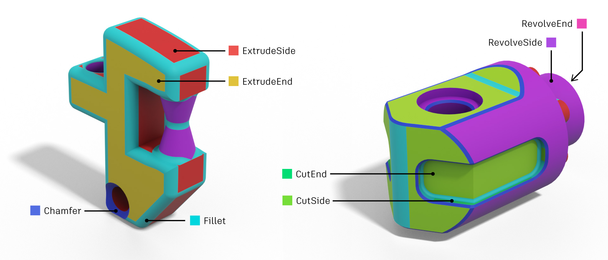

# Segmentation Subset
The Segmentation Subset contains a segmentation of design bodies based on the modeling operation used to create each face, e.g. Extrude, Fillet, Chamfer etc...

## Overview
Segmentation data is extracted from the parametric feature timeline of each Fusion 360 CAD model. We choose a small subset of the most common modeling operations: *extrude*, *chamfer*, *fillet*, and *revolve*, and record the faces that were generated by these modeling operations. 

Fusion 360 allows you to see the faces that were generated by each operation by clicking on the appropriate timeline feature. In the example below you can see that by clicking on the fillet feature, certain faces are highlighted in blue.

### Labels
To create useful labels from the CAD modeling operations we further subdivide the labels as follows. We divide the faces created by extrude and revolve operations into side and end faces. We divide extrude operations into additive (i.e. adding) and subtractive (i.e. cutting) extrusion operations.

The set of eight possible labels for each face are: 
 - ExtrudeSide
 - ExtrudeEnd
 - CutSide
 - CutEnd
 - Fillet
 - Chamfer
 - RevolveSide
 - RevolveEnd

## Data Formats

The segmentation subset contains a total of 36,985 3D models in three different representations: B-Rep, mesh, and point cloud. 

### B-Rep
The `breps` folder contains solid models (B-Rep) in the Autodesk Shape Manager solid text format (.smt). These files can be read into Fusion 360 and other Autodesk products. The [Fusion 360 API](http://help.autodesk.com/view/fusion360/ENU/?guid=GUID-7B5A90C8-E94C-48DA-B16B-430729B734DC) gives extensive access to the underlying B-Rep data structure and various formats for conversion (e.g. STEP, IGES).

The `timeline_info` folder contains json data which describes each solid model. The order of faces in the json file will match the order of faces when accessed via the Fusion API. The `bounding box` and `point_on_face` data can be used to double check this.

### Mesh
The `meshes` folder contains high quality meshes in [`.obj` format](https://en.wikipedia.org/wiki/Wavefront_.obj_file). The meshes are guaranteed to be watertight and manifold. The `.seg` text file gives a segment index for each triangle in the obj data, corresponding to the eight labels listed above. The `.fidx` text file gives the face index for each triangle in the obj data.  These indices will point into the array of faces in the `timeline_info/*.json` files.

### Point Cloud
The `point_clouds` folder contains point clouds with 2048 samples in `.xyz` text files. Each row of the `.xyz` file contains the `x`, `y`, `z` of the point and unit normal of triangle the point was drawn from. The `.seg` text file gives the segment index for each point. The `.fidx` file gives the face index for each point. 

## Other Notes
To restrict the dataset to a limited set of features we 'suppress' some CAD modeling operations, slightly modifying the design from its original state.

Point cloud data is generated by randomly sampling an even distribution of 2048 points over the surface of the triangle mesh. As the number of points on a triangle face is determined by area, very small faces have a low probability of having points sampled.

## Train/Test Split
